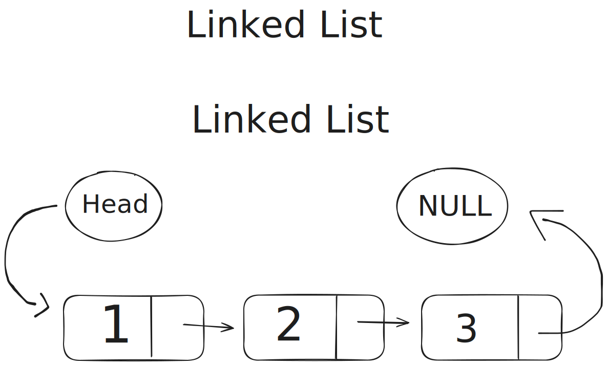

# Linked List

A linked list is a linear data structure where elements are stored in nodes. Each node contains two parts: data and a reference (or pointer) to the next node in the sequence. Unlike arrays, linked lists do not have a fixed size in memory and can dynamically grow or shrink as needed.

## Operations

### Insertion
Inserting an element into a linked list involves creating a new node and updating the references appropriately to include the new node in the list. There are several common insertion scenarios:
- Insert at the beginning of the list
- Insert at the end of the list
- Insert after a specific node

### Deletion
Deleting an element from a linked list involves finding the node containing the element to be deleted and updating the references to exclude that node from the list. There are also several common deletion scenarios:
- Delete from the beginning of the list
- Delete from the end of the list
- Delete a specific node by value

### Traversal
Traversing a linked list means iterating through the nodes to access or manipulate each element. This operation is often used to display the elements of the list or perform some operation on each element.

### Searching
Searching for an element in a linked list involves traversing the nodes to find a specific element by its value.

