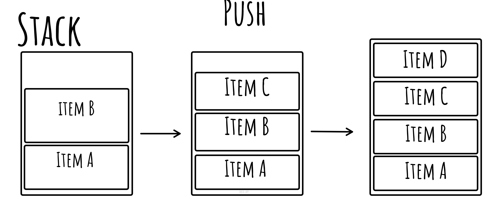
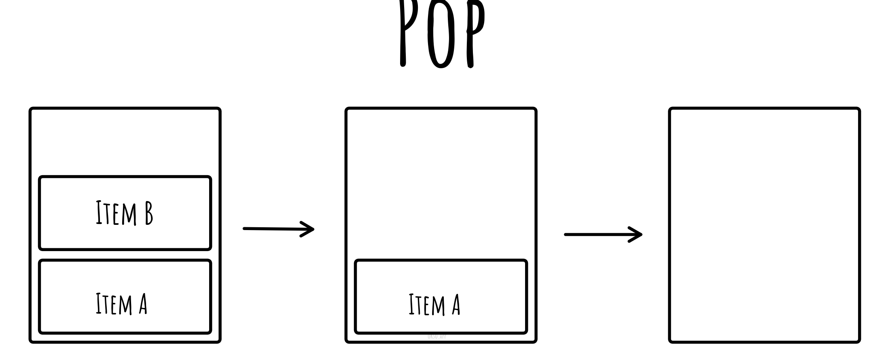

# Stack

A stack is a linear data structure based on the Last In First Out principle (LIFO), meaning that the last element to be inserted will be the first to be removed.

You can take as example a pile of plates kept on top of each other. the plate we placed on the top will be the first we will remove, so we can say the last plate we inserted was the first to be removed.

## Implementation

A stack can be implemented by using either an array or linked list. In both
cases the result will be the same, as what identifies the data structure are its operations (push and pop), with some helper operations.
The program must keep track of the last pushed element using a *top* variable.

## Operations

### Push
Pushing to the stack involves appending data to the collection used to implement this data structure, then update the *top* variable to keep track of the top of stack. When using a fixed size array, you must check its capacity to prevent overflows.

### Pop
Remove the top elements of the stack, then decrement the *top* variable and returns the popped value. Stack must not be empty to run this operation.

## Useful helpers

### Peek
Helper operation, returns the data on the top of the stack without removing it.

### IsEmpty
Helper operation to check if the collection is empty

### Size
Helper operation, return the current number of elements on the stack

## Links

- [Wikipedia](https://en.wikipedia.org/wiki/Stack_(abstract_data_type))
- [geeks for geeks](https://www.geeksforgeeks.org/stack-data-structure/)